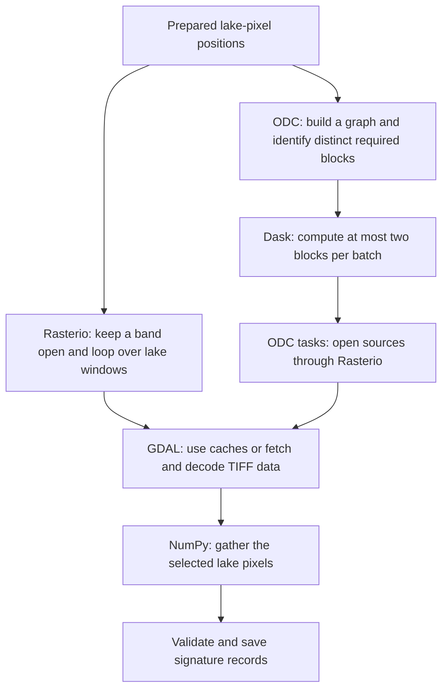

# Raster and improved lazy extraction walkthrough, 2026-09-22

Author: Codex, directed by the repository owner, with separate literature research and claim checking.
The owner requested a step-by-step explanation of reader behavior and literature explaining the efficiency comparison.
This record inspects existing code, measurements, primary documentation, and research papers. It starts no extraction and changes no measured result.

## What the observations say

**Measured:** Improved lazy extraction had lower total elapsed time in both shared-window B comparisons. Direct raster used less worker CPU in both.
The [result](../../benchmarks/results/lazy-reader-workloads.json) provides the numbers below.
The [timing review response](2026-09-22-sleep-rerun-review-response.md) explains why read-plus-extract components cannot be compared directly across readers.

| Shared-window workload | Reader | Total seconds | Worker CPU seconds | Requested MB | Peak aggregate GiB |
|---|---|---:|---:|---:|---:|
| 100 dispersed lakes | Raster | 496.2 | 10.8 | 569.7 | 0.223 |
| 100 dispersed lakes | Improved lazy | 457.2 | 24.4 | 534.9 | 0.293 |
| 1,000 Florida lakes | Raster | 101.8 | 9.1 | 352.0 | 0.332 |
| 1,000 Florida lakes | Improved lazy | 67.7 | 10.5 | 337.3 | 0.296 |

These are single observations with uncontrolled network conditions. Lower elapsed time and lower CPU consumption are different outcomes.
The RAM ordering also changes between cohorts. No reader dominates every resource measure.

## The shared starting point

**Code-inspected:** Both paths read the same compressed GeoTIFF assets and select the same prepared native-grid pixels.
Geometry classification and expected pixel positions were prepared before the timed extraction.
The timed raster path therefore does not repeatedly rasterize polygons.

A TIFF block is a stored rectangular group of pixels. A lake can intersect several blocks, and several lakes can intersect one block.
A Dask chunk is a unit of array work. Our improved implementation makes each spatial chunk match one TIFF block.
**Documented:** Window access retrieves intersecting storage blocks, even when the requested pixel window is smaller. [Rasterio windowed reading](https://rasterio.readthedocs.io/en/stable/topics/windowed-rw.html#reading).

The names describe two access paths into the same underlying machinery:

## Workflow B, step by step

**Code-inspected:** [workload_readers.py](../../benchmarks/workload_readers.py) implements both paths.

| Step | Direct raster | Improved lazy |
|---|---|---|
| 1. Organize work | Process one product and one band at a time | Process one product and one band at a time |
| 2. Prepare access | Open the band with Rasterio and retain that handle for its lakes | Build an ODC/Dask graph for the band's native grid |
| 3. Choose reads | Walk each lake's prepared block selections | Query distinct required blocks across all member lakes |
| 4. Execute reads | Call `source.read(window=...)` for each lake-block selection | Select up to two graph chunks and call `dask.compute` |
| 5. Obtain pixels | GDAL can reuse decoded blocks from the open dataset or obtain missing data | ODC tasks use Rasterio/GDAL to load native windows |
| 6. Serve lakes | Gather that lake's selected positions from the returned block | Gather every requesting lake's positions from each computed block |
| 7. Continue | Advance to another selection while retaining the band handle | Release the batch after consumption, then submit the next batch |

Both paths run the same value-gathering and signature code after reading.
The benchmark saves verification records and hashes. Full production storage writes and water-quality calculations are outside this comparison.

**Documented and code-inspected:** The ODC Rasterio backend opens a source inside each chunk read.
Its native-copy branch calls Rasterio's windowed `read`. Another branch handles reprojection. [ODC backend source](https://odc-stac.readthedocs.io/en/latest/_modules/odc/loader/_rio.html).
Our native-grid checks support the direct-read branch. Reprojection is not a supported explanation for these timing differences.

## Why the raster baseline is already efficient

Consider two lakes sharing one source block. This is an illustration, not a new measurement.
The raster loop can request that block twice while GDAL reuses its decoded contents on the second call.
The improved lazy loop identifies the shared block first, computes it once, and passes its array to both lakes.
Both mechanisms can avoid another download. Lazy planning removes repeated logical work explicitly, while raster reuse depends on cache availability.

**Documented:** GDAL maintains a raster block cache governed by `GDAL_CACHEMAX`. Repeated access can reuse cached blocks until eviction.
Our B-raster keeps the dataset open across member lakes. Actual decoded-cache hits were not counted. [GDAL caching](https://gdal.org/en/stable/user/configoptions.html#performance-and-caching).

**Measured:** Florida B-raster made 6,349 logical window calls but only 464 HTTP requests, requesting 352.0 MB.
B-lazy computed 454 required blocks through 233 compute calls, making 513 HTTP requests and requesting 337.3 MB.
The large reduction in logical calls therefore corresponds to a much smaller reduction in requested bytes.
Neither logical reads nor compute calls are counts of HTTP transfers or physical decodes.

**Documented:** GDAL also caches downloaded bytes separately from decoded raster blocks. Those bytes can survive closing and reopening a file.
Consequently, ODC's per-chunk opening does not imply a fresh metadata request every time. [GDAL HTTP access and caching](https://gdal.org/en/stable/user/virtual_file_systems.html#vsicurl-http-https-ftp-files-random-access).

## What the improved lazy path adds

**Code-inspected:** Lazy execution adds graph handling, chunk submission, source opening, spatial metadata checks, and array allocation around native reads.
It explicitly selects required blocks and shares their arrays across lakes.
Its two threads can overlap some read work, while the direct path makes its Python read calls sequentially.
GDAL can perform internal request handling within either path, so Python-loop concurrency does not fully specify network concurrency.

The improved loop waits for both blocks, processes their consumers, and then submits another batch.
It does not expose all lakes, products, bands, or blocks to the scheduler simultaneously.
The thread pool is reused. A compute call does not create a new pair of threads.

**Derived from measured counts:** Dispersed B-lazy computed 805 blocks through 645 calls, implying 160 two-block batches and 485 one-block batches.
Thus 75.2 percent of its batches supplied only one requested source block. Florida had 221 two-block batches and 12 one-block batches.
These counts describe available block-level concurrency. They do not measure time shares, thread utilization, internal task counts, or HTTP concurrency.

**Documented:** Repeated synchronous compute calls create execution boundaries and restrict opportunities to combine related work. [Dask compute guidance](https://docs.dask.org/en/stable/best-practices.html#avoid-calling-compute-repeatedly).
**Qualification:** Our improved loop already deduplicates required blocks. These boundaries do not establish that it repeats the old control's chunk reads.

**Documented:** The selected scheduler uses local threads, without distributed communication or interprocess array transfer.
Its documentation gives approximately 50 microseconds per task as an illustrative overhead estimate. [Dask local threads](https://docs.dask.org/en/stable/scheduling.html#local-threads).
That estimate is not a profile of this benchmark. Compute calls, chunks, and internal Dask tasks are different counts.
We cannot assign the observed extra CPU primarily to scheduling without profiling graph processing, source opening, decoding, and array work separately.

## Source blocks and useful task sizes

**Code-inspected:** The frozen assets have the following full-block layouts. Returned edge arrays can be smaller.

| Bands | Source block | Data type | Decoded bytes per full block |
|---|---|---|---:|
| Red, near infrared | 1,024 × 1,024 | uint16 | 2 MiB |
| Shortwave infrared | 512 × 512 | uint16 | 0.5 MiB |
| Scene classification | 512 × 512 | uint8 | 0.25 MiB |
| Coastal aerosol | 256 × 256 | uint16 | 0.125 MiB |

Layouts come from the frozen plans whose hashes are bound by the [execution evidence](../../benchmarks/results/lazy-reader-workloads.json).
The two-block batch is a conservative implementation choice inside the approved memory limits.

**Documented:** Dask recommends aligning chunks to storage while making tasks large enough to amortize overhead.
Aligned multiples of storage blocks can improve task granularity. Optimal shapes and sizes depend on the workload. [Dask array chunks](https://docs.dask.org/en/stable/array-chunks.html).
**Inference:** Our small chunks favor precise sparse reads, while the small batches constrain scheduling efficiency and overlap.
Simply enlarging a rectangular chunk can read unwanted blocks between lakes.
Grouping several selected blocks within a task is a different experiment from expanding the requested rectangle.

## How workflows A, C, and the old control differ

**Code-inspected:** Workflow A moves the lake loop outside the product loop.
Raster repeatedly opens bands for individual lakes. Improved lazy rebuilds graphs for those lake-band combinations and shares blocks only within the current lake.
Neither A path deliberately shares a decoded array across lakes.
The retained dispersed A-lazy also contains the older metadata behavior, as the [timing review](2026-09-22-sleep-rerun-review-response.md) explains.

Workflow C reads each whole band before gathering its lakes.
Raster makes one whole-band array read. Lazy computes all native chunks and assembles a whole-band array.
Every block is required in this mode, so deferred execution provides no opportunity to omit unneeded image blocks.

**Measured:** Florida C-raster made 205 HTTP requests for 1.519 GB. C-lazy made 2,173 for 1.540 GB.
The lazy path made 10.6 times as many requests for about 1.4 percent more requested bytes.
Its elapsed time was 266.2 seconds against raster's 159.8 seconds, with 40.9 versus 20.9 worker CPU seconds.
**Inference:** Request granularity and additional per-chunk work are credible explanations. Their individual contributions remain unmeasured.
**Documented:** GDAL can process multiple ranges in parallel and merge consecutive ranges within one read operation.
Larger reads can therefore present different grouping opportunities. [GDAL HTTP options](https://gdal.org/en/stable/user/configoptions.html#config-GDAL_HTTP_MULTIRANGE).

The old B-lazy-control uses 2,048-pixel chunks and computes each lake window separately.
A shared graph alone does not retain decoded arrays for later computes.
The improved reader changed both chunk granularity and how consumers share decoded blocks.
**Measured:** Its large improvement over that control remains valid. Florida requested bytes fell from 20.789 GB to 0.337 GB.

**Documented:** `persist` explicitly retains computed data and consumes memory. [Dask persistence](https://docs.dask.org/en/stable/api.html#dask.persist).
Persisting an entire scene would not automatically improve our once-per-required-block B loop.
It could retain unnecessary data where all consumers already finish before a block is released.

## What the literature establishes

**Documented:** The 2015 [Dask paper](https://proceedings.scipy.org/articles/Majora-7b98e3ed-013.pdf) describes blocked algorithms, parallel execution, and processing beyond available RAM.
That purpose does not establish faster decoding of a TIFF block. Our two paths use the same underlying decoder.

**Documented:** The 2020 [runtime-overhead study](https://arxiv.org/abs/2010.11105) distinguishes runtime costs from task-placement policy in distributed Dask.
Its Section III-B explicitly limits the experiments to the distributed backend.
Its numerical overhead results cannot be transferred to this local-threaded experiment or used to apportion our elapsed-time differences.

**Documented:** Current [Dask array guidance](https://docs.dask.org/en/stable/array-best-practices.html) also discusses when ordinary NumPy is sufficient and how chunk choices affect overhead.
**Inference:** The relevant question is how much redundant work or waiting a graph eliminates after paying for its execution machinery.
Our direct path already avoids whole-image reads in B and benefits from GDAL caching.
The improved path gains explicit block reuse and limited concurrency, while adding planning and execution costs.

## Verification and limits

The literature agent researched seven mechanism claims. A separate agent checked each against primary documentation and installed source.
All seven were confirmed with the qualifications recorded above. The 2015 paper's limited background claim received an additional independent check.
The checker also verified the execution counts and the derived single-block batch counts against the saved results and reader loop.
Sources were accessed on 2026-09-22. The 2015 abstract and introduction were available through indexed primary text despite a direct-fetch failure.
The 2020 PDF and current official documentation were inspected directly.

Installed versions inspected: Rasterio 1.5.1, GDAL 3.12.4, odc-stac 0.5.3, odc-loader 0.6.4, and Dask 2026.8.0.
Reader source and the saved result support the execution trace and measured counts.
No scheduler profile, cache-hit trace, or allocation attribution was collected. Mechanisms do not establish a numerical cause for each measured gap.
Repository verification passed:

- `uv sync --locked`: the pinned environment is current.
- `uv run ruff check .` and `uv run ruff format --check .`: passed, with 118 files already formatted.
- `uv run pytest -q`: 272 passed in 29.72 seconds, with upstream affine deprecation warnings.
- The four artifact checks passed: `collate_checks.py`, `collate_sensor_bands.py`, `render_options.py`, and `gap_report.py`, each through `uv run python tools/` with `--check`.
- `git diff --check`: passed.
- All twelve frozen execution source digests match. SHA-256 comparisons confirm the four current and historical result files remain unchanged.

## Proposed next step

Define a focused experiment that separates read grouping, concurrency, and execution overhead while preserving the approved memory limits.

1. Compare both readers with one read thread, then compare matched two-thread implementations.
2. Vary selected-block batch sizes without silently expanding lake windows.
3. Profile graph processing, file opening, reading, pixel gathering, and peak RAM with consistent timing boundaries.
4. Compare grouped whole-band reads with chunked whole-band reads, recording request sizes alongside counts.
5. Repeat comparable runs in alternating order before attributing elapsed differences to an implementation.

These are proposed controls, not a production selection or authorization for another extraction.
